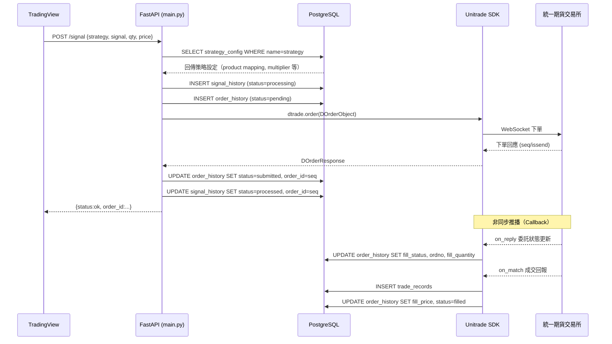

# 系統架構文件

> 最後更新：2026-06-30

---

## 一、模組說明（用人話解釋）

| 模組 | 檔案位置 | 負責什麼 |
|---|---|---|
| **後端 API** | `main.py` | 整個後端的核心。接收 TradingView 傳來的 Webhook 或訊號、處理手動下單、管理策略設定、查詢帳務/部位，以及排程自動同步。 |
| **資料庫層** | `database.py` | 連接 PostgreSQL，提供 SQLAlchemy Session 給其他模組使用。 |
| **資料模型** | `models.py` | 定義四張資料表的欄位結構（OrderHistory、StrategyConfig、SignalHistory、TradeRecord）。 |
| **Unitrade 客戶端** | `unitrade_client.py` | 封裝統一期貨官方 SDK。負責登入、保持單例連線、掛載委託回報/成交回報 Callback、以及向交易所查詢歷史委託與成交（History Sync）。 |
| **排程器** | `main.py`（APScheduler） | 每天 04:50 和 13:55（台北時間）自動觸發 History Sync，確保夜盤換日與日盤收盤後的資料不漏失。 |
| **前端 Dashboard** | `frontend/` | Angular 20 SPA。包含六個頁面：總覽（Dashboard）、下單（Orders）、策略管理（Strategies）、訊號歷史（Alerts）、成交紀錄（Trades）、持倉（Positions）。 |
| **資料庫 Migration** | `db/migrations/` | 每次結構變更的 SQL 腳本，按版本號依序執行。 |

---

## 二、系統架構圖

```mermaid
graph TD
    subgraph 外部訊號來源
        TV[TradingView Alert<br/>Pine Script]
        Human[人工操作<br/>前端 UI]
    end

    subgraph 前端 Angular SPA
        UI_Dashboard[Dashboard 總覽]
        UI_Orders[Orders 下單]
        UI_Strategy[Strategies 策略管理]
        UI_Alerts[Alerts 訊號歷史]
        UI_Trades[Trades 成交紀錄]
        UI_Positions[Positions 持倉]
    end

    subgraph 後端 FastAPI
        WH[POST /webhook<br/>直接下單 Webhook]
        SIG[POST /signal<br/>訊號驅動下單]
        SIG_SIMPLE[POST /signal/simple<br/>極簡訊號]
        ORDER[POST /order<br/>手動下單]
        STRAT[/strategies/* CRUD]
        ACCT[GET /margin<br/>GET /positions<br/>GET /unliquidations]
        HIST[POST /history-sync<br/>手動同步]
        SCHED[APScheduler<br/>04:50 / 13:55 自動同步]
    end

    subgraph Unitrade 客戶端 unitrade_client.py
        SDK[Unitrade SDK 單例]
        CB_REPLY[on_reply 委託回報]
        CB_MATCH[on_match 成交回報]
        SYNC[_sync_history 歷史同步]
    end

    subgraph PostgreSQL
        T_ORDER[(order_history)]
        T_STRAT[(strategy_config)]
        T_SIGNAL[(signal_history)]
        T_TRADE[(trade_records)]
    end

    subgraph 統一期貨交易所
        EXCH[統一期貨 API Server<br/>WebSocket]
    end

    TV -- HTTPS Webhook --> WH
    TV -- HTTPS Webhook --> SIG
    TV -- HTTPS Webhook --> SIG_SIMPLE
    Human --> UI_Orders
    Human --> UI_Strategy

    UI_Dashboard -- REST API --> 後端 FastAPI
    UI_Orders -- REST API --> ORDER
    UI_Orders -- REST API --> T_ORDER
    UI_Strategy -- REST API --> STRAT
    UI_Alerts -- REST API --> T_SIGNAL
    UI_Trades -- REST API --> T_TRADE
    UI_Positions -- REST API --> ACCT

    WH --> ORDER_CORE{submit_unitrade_order}
    SIG_SIMPLE --> SIG
    SIG --> T_STRAT_READ[(讀取 strategy_config)]
    SIG --> SIGNAL_REC[(寫入 signal_history)]
    SIG --> ORDER_CORE
    ORDER --> ORDER_CORE

    ORDER_CORE -- 寫入 pending --> T_ORDER
    ORDER_CORE -- 下單請求 --> SDK

    SDK -- WebSocket 連線 --> EXCH
    EXCH -- 委託狀態推播 --> CB_REPLY
    EXCH -- 成交推播 --> CB_MATCH
    CB_REPLY -- 更新 fill_status/ordno --> T_ORDER
    CB_MATCH -- 新建成交紀錄 --> T_TRADE
    CB_MATCH -- 更新 fill_price/status --> T_ORDER

    SCHED -- 定時觸發 --> SYNC
    HIST --> SYNC
    SYNC -- query_reply/query_match --> EXCH
    SYNC -- upsert --> T_ORDER
    SYNC -- insert new --> T_TRADE

    ACCT -- daccount API --> SDK
    STRAT -- CRUD --> T_STRAT
```

---

## 三、資料流圖（TradingView → 成交回報 完整路徑）



---

## 四、ER 圖（實體關係圖）

```mermaid
erDiagram
    strategy_config {
        int id PK
        string strategy_name UK "策略名稱（唯一）"
        string source_product "訊號商品代碼"
        string target_product "實際下單商品代碼"
        int quantity_multiplier "口數倍數"
        int max_position "最大持倉"
        string order_type "L/M/P"
        string order_condition "I/R/F"
        string dtrade "Y/N 當沖"
        string entry_order_type "進場單別"
        string entry_order_condition "進場條件"
        string exit_order_type "出場單別"
        string exit_order_condition "出場條件"
        string account "交易帳號（可空）"
        string sub_account "子帳號"
        bool enabled "是否啟用"
        bool auto_rollover "自動換月"
        text description "備註"
        datetime created_at
        datetime updated_at
    }

    signal_history {
        int id PK
        string strategy_name FK "對應 strategy_config.strategy_name（邏輯 FK）"
        string signal_type "long_entry / long_exit / short_entry / short_exit"
        string signal_product "原始訊號商品"
        int signal_quantity "原始訊號數量"
        float signal_price "原始訊號價格"
        string signal_note "備註"
        string actual_product "實際下單商品"
        int actual_quantity "實際下單數量"
        string actual_bs "B/S"
        string status "processing / processed / ignored / failed"
        string order_id FK "對應 order_history.order_id（邏輯 FK）"
        text error_message
        json raw_payload "原始 JSON payload"
        datetime created_at
    }

    order_history {
        int id PK
        string symbol "商品代碼"
        string code "交易所代碼（可空）"
        string action "B/S"
        int quantity "委託口數"
        float price "委託價格"
        string strategy "策略名稱（可空）"
        string order_type "L/M/P"
        string order_condition "I/R/F"
        string open_close_flag "0/1/空"
        string dtrade "Y/N"
        string note "備註"
        string account "交易帳號"
        string sub_account "子帳號"
        string source "webhook / manual / signal"
        string status "pending/submitted/filled/partial_filled/cancelled/failed"
        string order_result "Unitrade 回應 JSON"
        string error_message "錯誤訊息"
        string order_id "Unitrade seq（主要追蹤鍵）"
        string seqno "序號"
        string ordno "委託書號"
        string fill_status "交易所 orderstatus 字串"
        int fill_quantity "已成交口數"
        float fill_price "平均成交價"
        int cancel_quantity "取消口數"
        datetime created_at
        datetime updated_at
    }

    trade_records {
        int id PK
        string seq FK "對應 order_history.order_id（邏輯 FK）"
        string network_id "網路流水序號（去重鍵）"
        string orderno FK "對應 order_history.ordno（邏輯 FK）"
        string account "交易帳號"
        string sub_account "子帳號"
        string product_kind "1=期貨 2=選擇權"
        string product_id "商品代碼"
        string bs "B/S"
        float match_price "成交價"
        int match_qty "成交口數"
        string match_seq "成交序號"
        string match_time "成交時間"
        string note "備註"
        string mdate "成交日期"
        datetime created_at
    }

    strategy_config ||--o{ signal_history : "strategy_name（邏輯關聯）"
    signal_history }o--o| order_history : "signal_history.order_id = order_history.order_id"
    order_history ||--o{ trade_records : "order_history.order_id = trade_records.seq"
```



> **注意**：所有表間關聯均為**邏輯關聯**（字串比對），資料庫層沒有設 FOREIGN KEY 約束。這代表刪除策略或委託記錄時，子表資料不會自動清除。

---

## 五、資料重複 / 不同步風險

以下列出同一份資料存在多個地方的情況，每項都標示風險等級與建議。

### 5-1 成交資訊同時存在 `order_history` 和 `trade_records`（✅ 已修正）

| 欄位 | 在 `order_history` | 在 `trade_records` |
|---|---|---|
| 成交價 | `fill_price` | `match_price` |
| 成交量 | `fill_quantity` | `match_qty` |
| 委託書號 | `ordno` | `orderno` |
| 帳號 | `account` | `account` |
| 商品 | `symbol` | `product_id` |

**發生情境**：`on_match` 觸發時，程式碼同時  
1. `INSERT INTO trade_records`（完整成交明細）  
2. `UPDATE order_history SET fill_price, fill_quantity, status='filled'`（彙總更新）  

**風險**：若同一委託有**多筆部分成交**，`order_history.fill_price` 只會存最後一筆的成交價，無法正確反映加權平均價；而 `trade_records` 裡每筆獨立成交都是完整的。兩邊計算出的「實際成交均價」會不一致。

**修正方式**（已套用）：`on_match` 改用 `db.flush()` 先將本筆 trade 寫入，再對 `TradeRecord` 做 `SUM(match_qty * match_price) / SUM(match_qty)` 計算加權均價，並以累計 `SUM(match_qty)` 與 `order.quantity` 比較決定 `filled` 或 `partial_filled`。`order_history.fill_price` 現在是正確的加權均價快取。

---

### 5-2 委託狀態分裂成兩個欄位（✅ 已修正）

`order_history` 有兩個狀態欄位：

| 欄位 | 來源 | 內容 |
|---|---|---|
| `status` | 本系統邏輯 | `pending` / `submitted` / `filled` / `partial_filled` / `cancelled` / `failed` |
| `fill_status` | 交易所原始字串 | `全部成交` / `部分成交` / `PendingSubmit` / `Submitted` 等 |

這兩個欄位**各自更新**（`on_reply` 更新 `fill_status`，`on_match` 更新 `status`），可能出現 `status='filled'` 但 `fill_status='部分成交'` 的矛盾狀況（尤其部分成交再補足的情境）。

**修正方式**（已套用）：`on_reply` 現在同時呼叫 `_orderstatus_to_db_status()` 更新 `status`，並加入「不回降」保護（`_FINALITY` 字典），確保交易所送來的中間狀態不會將已成交的委託降回 `submitted`。

---

### 5-3 帳號資訊三個地方重複儲存（ℹ️ 低風險）

| 位置 | 欄位 |
|---|---|
| 環境變數 `UNITRADE_ACTNO` | 全域預設帳號 |
| `strategy_config.account` | 策略專屬帳號（可覆蓋環境變數） |
| `order_history.account` | 每筆委託實際使用的帳號（下單時從上兩者取值後複製） |

這是正常的設計（`order_history` 保留歷史快照），**不會造成不同步**，但須注意：修改 `strategy_config.account` 只影響**之後**的新委託，不會回溯修改舊紀錄。

---

### 5-4 策略名稱字串關聯，無 FK 約束（ℹ️ 低風險）

`signal_history.strategy_name` 和 `order_history.strategy` 都是直接存策略名稱字串，`strategy_config` 中若刪除策略，歷史記錄不會報錯，但查詢時找不到對應的策略設定。目前系統是唯讀查詢歷史，問題不大，但日後若需要「按策略匯總損益」，需要注意孤立資料的過濾。

---

### 5-5 History Sync 可能與 Callback 資料重複（ℹ️ 低風險）

`_sync_history()` 使用 `order_id(seq)` 做 upsert（找到就更新，找不到就新建），`trade_records` 用 `network_id` 做去重。已有機制避免重複，但若 `network_id` 為空（極少數情況），仍可能插入重複的成交記錄。

---

## 六、快速查表：API Endpoint → 資料表

| Endpoint | 方法 | 讀/寫 | 資料表 |
|---|---|---|---|
| `/webhook` | POST | 寫 | `order_history` |
| `/order` | POST | 寫 | `order_history` |
| `/orders` | GET | 讀 | `order_history` |
| `/signal` | POST | 寫 | `signal_history`, `order_history` |
| `/signal/simple` | POST | 寫 | `signal_history`, `order_history` |
| `/signals` | GET | 讀 | `signal_history` |
| `/strategies` | GET/POST | 讀/寫 | `strategy_config` |
| `/strategies/{name}` | GET/PUT/DELETE/PATCH | 讀/寫 | `strategy_config` |
| `/trades` | GET | 讀 | `trade_records` |
| `/order-replies` | GET | 讀 | `order_history` |
| `/history-sync` | POST | 寫 | `order_history`, `trade_records` |
| `/margin` | GET | 讀 | Unitrade API（不入庫） |
| `/positions` | GET | 讀 | Unitrade API（不入庫） |
| `/unliquidations` | GET | 讀 | Unitrade API（不入庫） |
| `/product-lookup/*` | GET | 讀 | 外部 pfctrade API（不入庫） |
